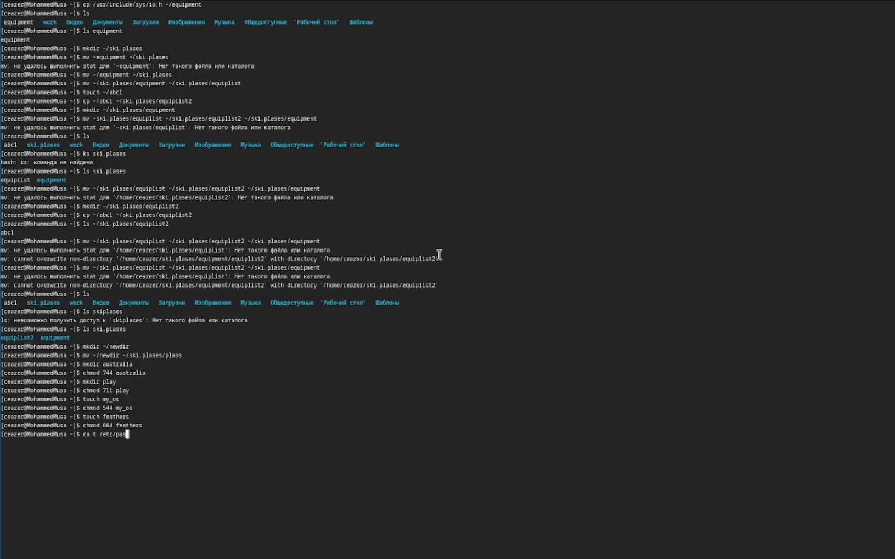
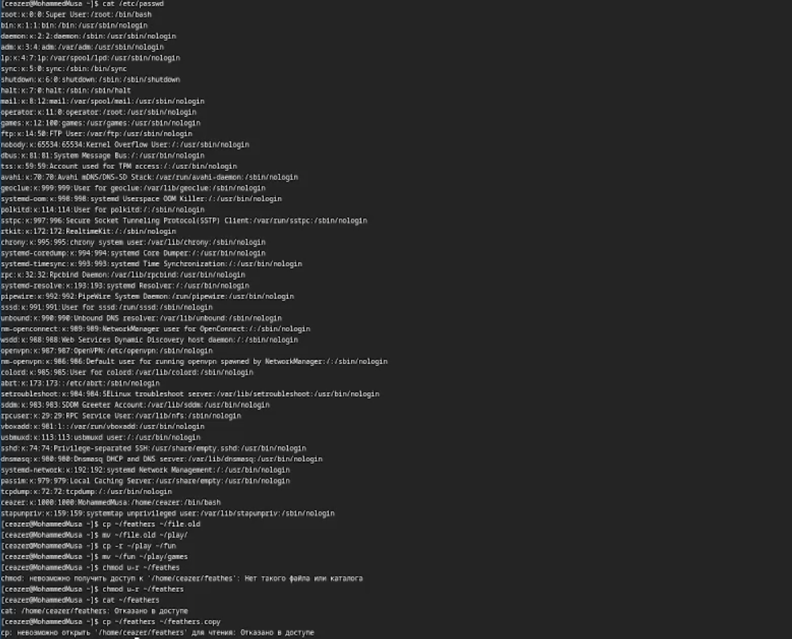
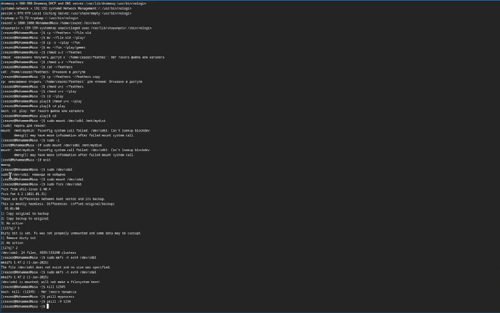

## Author
### Мохамед Муса
### 1032248286@pfur.ru
## Title
# отчёт по лабораторной работе
### Lab07

# Цель работы
Цель этой лабораторной работы - глубже погрузиться в использование командной строки с помощью новых команд

# Выполнение лабораторной работы :
- Задания с 1 по 3 были выполнены на первом рисунке, как показано на нем :

- На втором фото были выполнены задания с 3 по 4 : 

- Наконец, задание 5 было выполнено на последней фотографии :

# Вывод : 
В этой лабораторной работе я попрактиковался и углубился в изучение этих трех команд cp, mv и chmod, одного из самых полезных инструментов в Linux.
